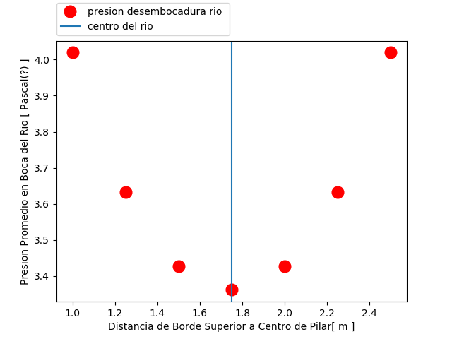
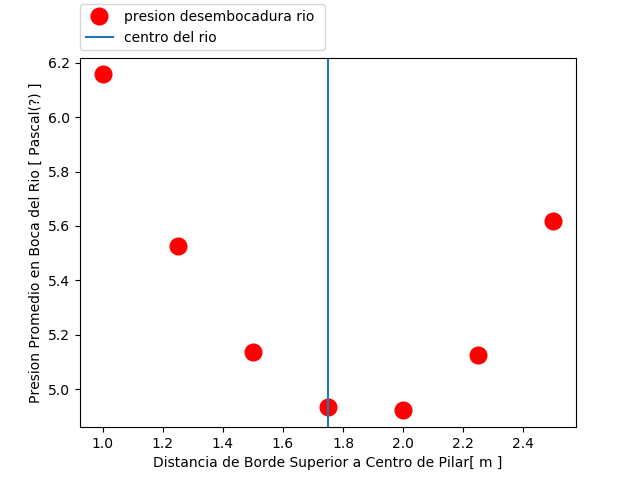
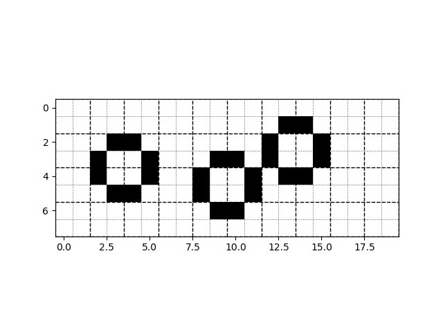
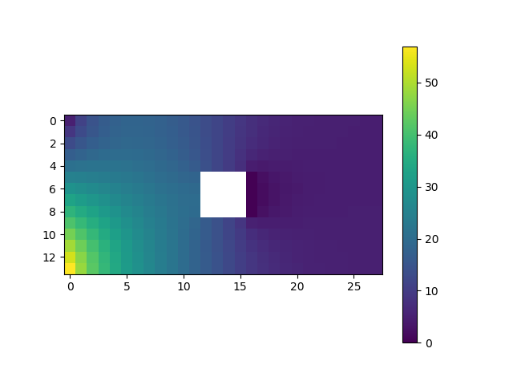
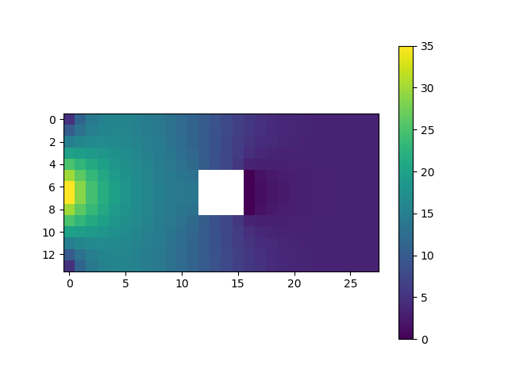
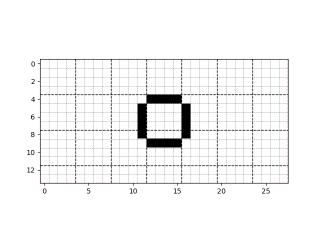

## Tareita 1

### Pilar Y Condición de Borde

- Para trabajar con pilares se debe tener en cuenta las celdas adyacentes a estos.
- En este caso y para simplificar los cálculos y el programa establecí las siguientes restricciones* para los pilares:
	- El contorno (celdas adyacente a una cara del pilar) no puede limitar(ser adyacente) con otro pilar
	- Además no puede limitar con el borde( celdas exteriores del rio)
	- *Nota: Estas restricciones no son del todo necesarias para resolver el problema*

- Para las diferentes caras o contornos del pilar ocuparemos diferentes ecuaciones para calcular el valor de la celda:
	- celda derecha ( posterior o que mira río abajo), se aplica una condición de bordes Dirichet y su valor se mantiene constante en 0
	- Condiciones de Neumann
		- celda izquierda( a contra corriente) su valor se calcula como: Presion[y][x] = 0.25\*( 2\*Presion[y][x - 1] + Presion[y + 1][x] + Presion[y-1][x])
    	- celda superior: Presion[y][x] = 0.25 \* (2 \* Presion[y - 1][x] + Presion[y][x - 1] + Presion[y][x + 1])
    	- celda inferior: Presion[y][x] = 0.25 \* (2 \* Presion[y + 1][x] + Presion[y][x - 1] + Presion[y][x + 1])

- Trabajé con 2 condiciones de borde de tipo Dirichet para la frontera izquierda.

### Manejo de Varios Pilares

 - Para trabajar con varios pilares lo que se hace es registrar las celdas adyacentes de los pilares y el lado por el cual limita, de esta manera en el método start (que realiza las iteraciones para el cálculo de la presiones), para cada celda se pregunta si esta límita con algún pilar y por el lado que límita, para aplicar la ecuación correcta.*
 - *Debido a las restricciones a los pilares no ocurrirá que una celda delimite con más de un pilar (por ejemplo ala izquierda con un pilar y con otro por la derecha) pero si se requeriese se podría agregar más condiciones al método start y revisar que ecuaciones deberían cumplir las celdas para estos casos* 
 - El método addPilar corrobora si es posible añadir el pilar o si incumple alguna condición

### Gráficos Presión

- El método medir_presiones toma un río dado y una posición x, para ese río y esa posición iterará con un pilar para cada posición y (a lo ancho del río ) posible.
- Luego cálcula el promedio  de la presiones de la última columna
- Y se gráfica la presión promedio respecto a la posición del pilar.
- En el siguiente ejemplo se usa un rio de 3.5[m] ancho x 7[m] largo con un grilla diferencial de 0.25[m], la posición x del pilar es justo la mitad del río.
	- 
	- 

- En Ambos casos la presión es mínima cuando el pilar se encuentra en el centro y parece ser el conveniente para disminuir la presión río abajo

### Visualizar Río
- Para la visualización del rio y sus pilares cree la método show_map() que grafica "un mapa" del río: 
		- Los contornos de los pilares se muestran en  celdas Negras 
		- Las celdas blancas representan el resto del río (o el pilar si se encuentra rodeada por celdas negra)
		- Las líneas plomizas muestras las grillas diferenciales
		- Las líneas negras muestran las coordenadas en metros.
	- 

-Para la visualización de las presiones se ocupa el método plot, A continuación se muestra el caso del pilar que minimiza la presión.
	- 
	- 
	- 
